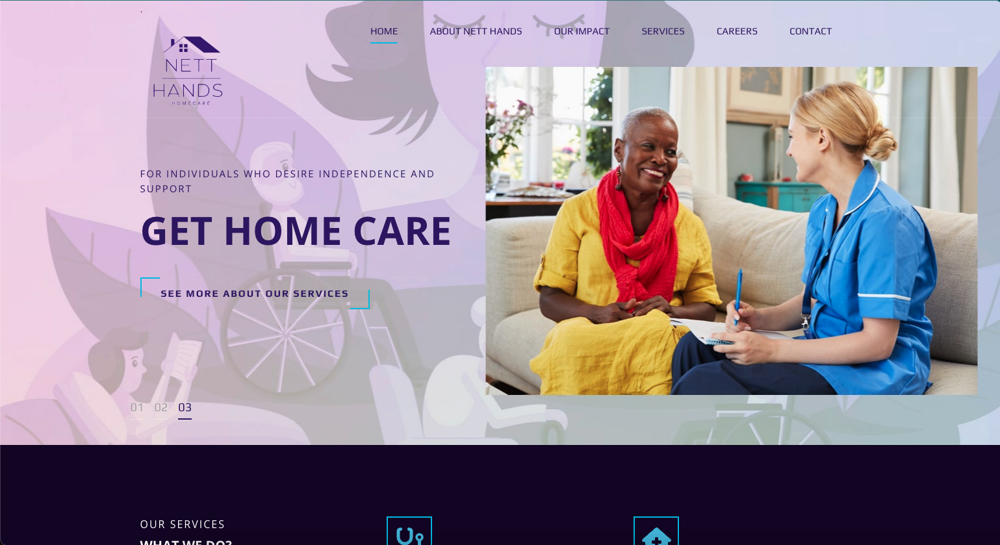

<a id="readme-top"></a>

<!-- PROJECT SHIELDS -->
<div align="center">

[](issues-url)  [](license-url)    [](linkedin-url)

</div>
<!-- PROJECT LOGO -->

<br />
<div align="center">
  <a href="https://github.com/Terry-BrooksJr/nhhc_workplace_management_system">
    
  </a>

<h3 align="center">NHHC Workplace Management System</h3>

<p align="center">
    The NHHC Workplace Management System is a custom comprehensive tool designed to streamline workplace operations by managing resources, employees, and daily tasks in a centralized system. Built with Python, Django, and PostgreSQL, it facilitates efficient operations, performance tracking, and resource allocation.

<br />
<a href="http://docs.netthandshome.care"><strong>Read the Admin User's Manual »</strong></a>
<br />
<br />

<a href="https://github.com/Terry-BrooksJr/nhhc_workplace_management_system/issues/new?labels=bug&template=bug-report---.md">Report Bug</a>

<a href="https://github.com/Terry-BrooksJr/nhhc_workplace_management_system/issues/new?labels=enhancement&template=feature-request---.md">Request Feature</a>
</p>
</div>

<!-- TABLE OF CONTENTS -->

<details>
  <summary>Table of Contents</summary>
  <ol>
    <li>
      <a href="#about-the-project">About The Project</a>
      <ul>
        <li><a href="#built-with">Built With</a></li>
      </ul>
    </li>
    <li>
      <a href="#getting-started">Getting Started</a>
      <ul>
        <li><a href="#prerequisites">Prerequisites</a></li>
        <li><a href="#installation">Installation</a></li>
      </ul>
    </li>
    <li><a href="#usage">Usage</a></li>
    <li><a href="#roadmap">Roadmap</a></li>
    <li><a href="#contributing">Contributing</a></li>
    <li><a href="#license">License</a></li>
    <li><a href="#contact">Contact</a></li>
    <li><a href="#acknowledgments">Acknowledgments</a></li>
  </ol>
</details>

<!-- ABOUT THE PROJECT -->

## About The Project

[!



[Product Name Screen Shot][product-screenshot]](http://netthandshome.care)

The NHHC Workplace Management System is a custom comprehensive tool designed to streamline workplace operations by managing resources, employees, and daily tasks in a centralized system. Built with Python, Django, and PostgreSQL, it facilitates efficient operations, performance tracking, and resource allocation.

It is a bespoke HRIS system that is customized around contractual requirements set forth by Partner of the Illinois Department of Aging. At the time of this writing, any client or patient information has been excluded.

This application makes no claims to be HIPPA compliant. While it's design does follow the core precepts of data privacy and security in the United States, it does require individualized production harding.

<p align="right">(<a href="#readme-top">back to top</a>)</p>

### Built With

* Primary Coding Language: Python (V3.12.5)
* Frameworks: [](https://www.djangoproject.com/https://www.django.org)
* Database/DBMS: Relational - [](https://www.postgresql.org/)
* Cache Data Store: DragonFly DB [![PostgreSQL][PostgreSQL.com]][PostgreSQL-url]
* Secrets Management: Doppler

<p align="right">(<a href="#readme-top">back to top</a>)</p>

<!-- GETTING STARTED -->

## Getting Started

To get a local copy up and running follow these simple steps.

### Prerequisites

* Python 3.11+
  ```sh
  sudo apt-get install python3
  ```

### Installation

1. Clone the repo
   ```sh
   git clone https://github.com/Terry-BrooksJr/nhhc_workplace_management_system.git
   ```
2. Install Python packages
   ```sh
   pip install -r requirements.txt
   ```
3. Set up the database
   ```sh
   python manage.py migrate
   ```
4. Run the development server
   ```sh
   python manage.py runserver
   ```

<p align="right">(<a href="#readme-top">back to top</a>)</p>

<!-- USAGE EXAMPLES -->

## Usage

This system can be used for managing daily operations, tracking employee performance, and handling resource allocation within the workplace.

_For more examples, please refer to the [User Manual](http://docs.netthandshome.care)_

<p align="right">(<a href="#readme-top">back to top</a>)</p>

<!-- ROADMAP -->

## Roadmap

- [ ] Printing Employee Profiles For Auditing
- [ ] Enhancing Announcements to also send SMS announcements campaigns
- [ ] Develop Resource Management Module
- [ ] Add Employee Performance Tracking
- [ ] Integrate with third-party tools

See the [open issues](https://github.com/Terry-BrooksJr/nhhc_workplace_management_system/issues) for a full list of proposed features (and known issues).

<p align="right">(<a href="#readme-top">back to top</a>)</p>

<!-- CONTRIBUTING -->

## Contributing

Contributions are what make the open-source community such an amazing place to learn, inspire, and create. Any contributions you make are **greatly appreciated**.

If you have a suggestion that would make this better, please fork the repo and create a pull request. You can also simply open an issue with the tag "enhancement".
Don't forget to give the project a star! Thanks again!

1. Fork the Project
2. Create your Feature Branch (`git checkout -b feature/AmazingFeature`)
3. Commit your Changes (`git commit -m 'Add some AmazingFeature'`)
4. Push to the Branch (`git push origin feature/AmazingFeature`)
5. Open a Pull Request

<p align="right">(<a href="#readme-top">back to top</a>)</p>

### Top contributors:

<a href="https://github.com/Terry-BrooksJr/nhhc_workplace_management_system/graphs/contributors">
  
</a>

<!-- LICENSE -->

## License

Distributed under the GNU General Public License. See `LICENSE.txt` for more information.

<p align="right">(<a href="#readme-top">back to top</a>)</p>

<!-- CONTACT -->

## Contact

Terry Brooks Jr - [@twitter_handle](https://twitter.com/NomadicSaaS_PM) - terry.brooks@brooksjr.com

Project Link: [https://github.com/Terry-BrooksJr/nhhc_workplace_management_system](https://github.com/Terry-BrooksJr/nhhc_workplace_management_system)

<p align="right">(<a href="#readme-top">back to top</a>)</p>

<!-- ACKNOWLEDGMENTS -->

## Acknowledgments

* [Best-README-Template](https://github.com/othneildrew/Best-README-Template)
* []()
* []()

<p align="right">(<a href="#readme-top">back to top</a>)</p>
<!-- MARKDOWN LINKS & IMAGES -->
<!-- https://www.markdownguide.org/basic-syntax/#reference-style-links -->
[contributors-shield]: https://img.shields.io/github/contributors/Terry-BrooksJr/nhhc_workplace_management_system.svg?style=for-the-badge
[contributors-url]: https://github.com/Terry-BrooksJr/nhhc_workplace_management_system/graphs/contributors
[forks-shield]: https://img.shields.io/github/forks/Terry-BrooksJr/nhhc_workplace_management_system.svg?style=for-the-badge
[forks-url]: https://github.com/Terry-BrooksJr/nhhc_workplace_management_system/network/members
[stars-shield]: https://img.shields.io/github/stars/Terry-BrooksJr/nhhc_workplace_management_system.svg?style=for-the-badge
[stars-url]: https://github.com/Terry-BrooksJr/nhhc_workplace_management_system/stargazers
[issues-shield]: https://img.shields.io/github/issues/Terry-BrooksJr/nhhc_workplace_management_system.svg?style=for-the-badge
[issues-url]: https://github.com/Terry-BrooksJr/nhhc_workplace_management_system/issues
[license-shield]: https://img.shields.io/github/license/Terry-BrooksJr/nhhc_workplace_management_system.svg?style=for-the-badge
[license-url]: https://github.com/Terry-BrooksJr/nhhc_workplace_management_system/blob/master/LICENSE.txt
[linkedin-shield]: https://img.shields.io/badge/-LinkedIn-black.svg?style=for-the-badge&logo=linkedin&colorB=555
[linkedin-url]: https://linkedin.com/in/terryabrooks
[product-screenshot]: images/screenshot.png
[PostgreSQL]: https://img.shields.io/badge/Postgres-DBMS?style=for-the-badge&logo=postgresql&logoColor=white&logoSize=auto&label=V.16&labelColor=%230064a5&color=%23d24b03&cacheSeconds=3600
[Django]: https://img.shields.io/badge/Django-DBMS?style=for-the-badge&logo=django&logoColor=white&logoSize=auto&label=V.5.1.1&labelColor=%23092E20&color=%23092E20&cacheSeconds=3600
[Doppler]: 
[Next.js]: https://img.shields.io/badge/next.js-000000?style=for-the-badge&logo=nextdotjs&logoColor=white
[Next-url]: https://nextjs.org/
[React.js]: https://img.shields.io/badge/React-20232A?style=for-the-badge&logo=react&logoColor=61DAFB
[React-url]: https://reactjs.org/
[Vue.js]: https://img.shields.io/badge/Vue.js-35495E?style=for-the-badge&logo=vuedotjs&logoColor=4FC08D
[Vue-url]: https://vuejs.org/
[Angular.io]: https://img.shields.io/badge/Angular-DD0031?style=for-the-badge&logo=angular&logoColor=white
[Angular-url]: https://angular.io/
[Svelte.dev]: https://img.shields.io/badge/Svelte-4A4A55?style=for-the-badge&logo=svelte&logoColor=FF3E00
[Svelte-url]: https://svelte.dev/
[Laravel.com]: https://img.shields.io/badge/Laravel-FF2D20?style=for-the-badge&logo=laravel&logoColor=white
[Laravel-url]: https://laravel.com
[Bootstrap.com]: https://img.shields.io/badge/Bootstrap-563D7C?style=for-the-badge&logo=bootstrap&logoColor=white
[Bootstrap-url]: https://getbootstrap.com
[JQuery.com]: https://img.shields.io/badge/jQuery-0769AD?style=for-the-badge&logo=jquery&logoColor=white
[JQuery-url]: https://jquery.com
